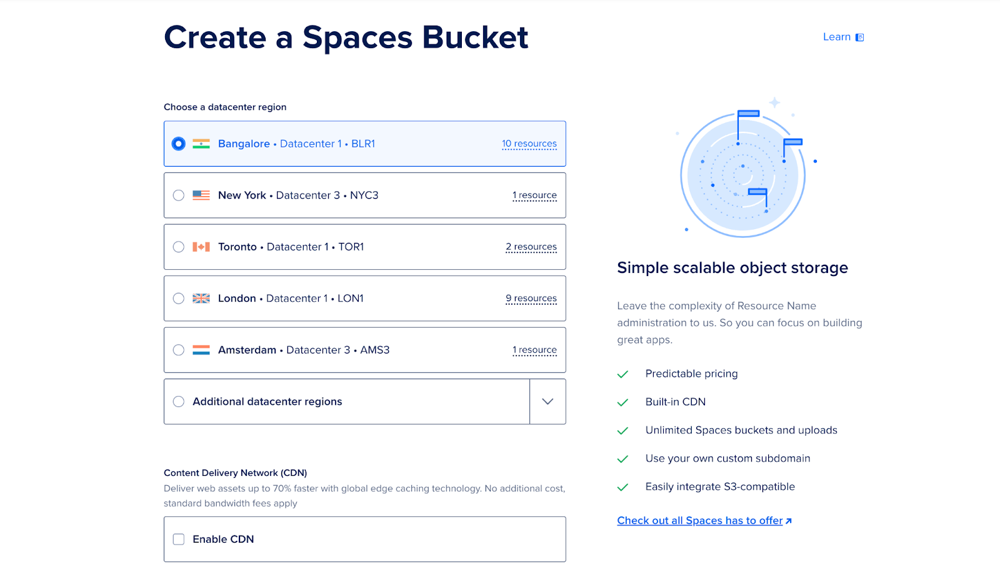

# **How to Use DigitalOcean Spaces Bucket as Tiered Storage in ClickHouse**

## **Introduction**

ClickHouse is an open-source columnar database management system that excels in high-performance OLAP queries and real-time analytics. However, scaling up data storage for ClickHouse can be challenging, especially as the volume of data grows. One efficient solution is to use **tiered storage**, which allows you to offload infrequently accessed data to a more cost-effective storage system while keeping frequently accessed data on faster, more expensive storage. Clickhouse supports various storage backends for data, including both local disks and remote options like **DigitalOcean Spaces**. When managing large volumes of data, it's common to use multiple storage devices.

**DigitalOcean Spaces** is an object storage service that can be integrated with ClickHouse as a tier in its tiered storage architecture. This tutorial will guide you through the steps required to configure DigitalOcean Spaces as a tiered storage option for your ClickHouse cluster.

In this tutorial, we will set up a simple Go application that sends batch logs to Clickhouse. Initially, the logs will be stored in hot storage (the default disk, also known as local), and then they will be transferred to the cold storage (for example, an S3 based storage like DO Spaces) after a specified interval of 2 minutes.


## **Prerequisites**

Before starting, make sure you have the following:

- A **DigitalOcean Spaces** bucket.

- **Access keys** for your DigitalOcean Spaces.

- Basic knowledge of ClickHouse configurations and object storage.


## **Step 1 — Create and Configure a DigitalOcean Space**

Log in to your DigitalOcean account at [https://cloud.digitalocean.com/\](https://cloud.digitalocean.com/](https://cloud.digitalocean.com/]\(https://cloud.digitalocean.com/\)) and create a new **Space** (bucket). This bucket will serve as your tiered storage for less frequently accessed data.

- Navigate to **Spaces** from the dashboard.


- Click on **Create Space**, provide a name, select a region, and set permissions.\




- Note down the **Endpoint URL**


- Note down the **Access Key** and **Secret Key** as they will be needed later. Generate one if you didn’t have it earlier.


At this point, your bucket is created and ready for integration with ClickHouse.

## **Step 2 — Setup ClickHouse server in Docker container**

To start, create a folder and name it `clickhouse`.

```
mkdir clickhouse
```

Create a Dockerfile under this folder and replace the placeholders for {YOUR\_AWS\_ACCESS\_KEY\_ID} and {YOUR\_AWS\_SECRET\_ACCESS\_KEY} with your access Key and secret Key respectively.

```
FROM clickhouse/clickhouse-server:latest

# Copy the config file to the container
COPY storage.xml /etc/clickhouse-server/config.d/storage.xml

# Copy the S3 table creation script
COPY create.sql /docker-entrypoint-initdb.d/

# Set environment variables for S3 credentials
ENV AWS_ACCESS_KEY_ID={YOUR_AWS_ACCESS_KEY_ID}
ENV AWS_SECRET_ACCESS_KEY={YOUR_AWS_SECRET_ACCESS_KEY}

# Expose ClickHouse HTTP and native ports
EXPOSE 8123 9000

USER clickhouse

# --config-file ./programs/server/config.xml
CMD ["clickhouse-server", "--config-file", "/etc/clickhouse-server/config.xml"]
```


### **Explanation:**

- `access_key_id` and `secret_access_key`: These are your DigitalOcean Spaces credentials.


### **Warning:**

- We're placing the credentials in the Dockerfile for simplicity in this tutorial, but this approach is not recommended for production environments.


## **Step 3 — Configure ClickHouse for S3-Compatible Storage**

Next, configure ClickHouse to use DigitalOcean Spaces as a tier in its storage system. This involves adding the **storage_configuration** to the `config.xml` file in your ClickHouse installation.

To use a Spaces bucket as a storage disk, it must first be declared in the ClickHouse configuration file. You can either modify the existing config.xml or, preferably, add a new file under the conf.d directory, which will later be merged into config.xml.

Create a file called `storage.xml`:
```
<clickhouse>
    <storage_configuration>
        <disks>
            <s3>
                <type>s3</type>
                <endpoint>{YOUR_S3_SPACES_BUCKET_URL}</endpoint>
                <use_environment_credentials>true</use_environment_credentials>
            </s3>
        </disks>
    </storage_configuration>
</clickhouse>
```

This section configures a remote disk (the DigitalOcean Space) that ClickHouse can use to store less frequently accessed data.

Note: Replace the placeholders for {YOUR\_S3\_SPACES\_BUCKET\_URL}, with your endpoint URL.

### **Explanation:**

- `endpoint`: This is the URL of the DigitalOcean region where your Space is located.

## **Step 4 — Create a Table with Tiered Storage**

Now, create a table in ClickHouse that utilizes tiered storage. You can specify multiple storage policies to define which data is stored on local disks and which is stored on remote (Spaces) disks.

Define a storage policy that moves older data to DigitalOcean Spaces after a certain period:

`create.sql`
```
CREATE TABLE IF NOT EXISTS tiered_logs (
    event_time DateTime,
    level String,
    message String
) ENGINE = MergeTree
ORDER BY (event_time)
TTL toDateTime(event_time) + INTERVAL 2 MINUTE TO VOLUME 'cold'
SETTINGS storage_policy = 's3_tiered';
```

### **Explanation:**

- `default`: This represents the local disk storage where recent or frequently accessed data is stored.
- `s3`: The remote storage (DigitalOcean Spaces) where older data is offloaded.

This setup ensures that new data is written to the local disk and older data is automatically moved to DigitalOcean Spaces.


## **Step 5 — Run the ClickHouse Server**

To start your clickhouse server simply run:

```
docker build -t clickhouse-demo .
docker run -d --name clickhouse-demo -p 8123:8123 -p 9000:9000 clickhouse-demo
```


### **Network Ports:**

- `8123`: This is the **HTTP** port used for communicating with ClickHouse through the HTTP interface. (<http://localhost:8123/play>). You can use this port to run SQL queries via a browser or through command-line tools like curl or Postman. It's often used for web applications or clients that interact with ClickHouse over HTTP. 
- `9000`: This is the **TCP** port, the main port for ClickHouse clients and servers to communicate with each other using the ClickHouse native protocol.
- `Ref`: https\://clickhouse.com/docs/en/guides/sre/network-ports


Verify using

```
docker ps
```


## **Step 6 — Run a simple go app which fires logs and batch send them to ClickHouse cluster**

In a new folder create a file called `main.go`:
```
package main

import (
	"database/sql"
	"fmt"
	"log"
	"os"
	"time"

	"github.com/ClickHouse/clickhouse-go"
	"github.com/sirupsen/logrus"
)

type ClickHouseHook struct {
	db        *sql.DB
	entries   []logrus.Entry
	batchSize int
}

// NewClickHouseHook establishes a connection to ClickHouse using the provided DSN.
func NewClickHouseHook(dsn string, batchSize int) (*ClickHouseHook, error) {
	db, err := sql.Open("clickhouse", dsn)
	if err != nil {
		return nil, err
	}
	if err := db.Ping(); err != nil {
		if exception, ok := err.(*clickhouse.Exception); ok {
			log.Fatalf("[%d] %s \n%s\n", exception.Code, exception.Message, exception.StackTrace)
		} else {
			log.Fatal(err)
		}
	}
	return &ClickHouseHook{db: db, batchSize: batchSize}, nil
}

// Fire is triggered by Logrus to log entries to ClickHouse.
func (hook *ClickHouseHook) Fire(entry *logrus.Entry) error {
	hook.entries = append(hook.entries, *entry)
	if len(hook.entries) >= hook.batchSize {
		if err := hook.flush(); err != nil {
			return err
		}
	}
	return nil
}

// flush sends the collected log entries to ClickHouse in a batch.
func (hook *ClickHouseHook) flush() error {
	tx, err := hook.db.Begin()
	if err != nil {
		return err
	}

	stmt, err := tx.Prepare("INSERT INTO tiered_logs (event_time, level, message) VALUES (?, ?, ?)")
	if err != nil {
		return err
	}
	defer stmt.Close()

	for _, entry := range hook.entries {
		if _, err := stmt.Exec(entry.Time, entry.Level.String(), entry.Message); err != nil {
			return err
		}
	}

	if err := tx.Commit(); err != nil {
		return err
	}

	// Clear the entries after flushing
	hook.entries = nil
	return nil
}

// Levels returns the logging levels for which the hook is triggered.
func (hook *ClickHouseHook) Levels() []logrus.Level {
	return logrus.AllLevels
}

func main() {
	// ClickHouse DSN (replace with your credentials and host)
	dsn := "tcp://localhost:9000?database=default&username=default&password=&debug=true"

	// Create ClickHouse hook with a batch size of 5
	hook, err := NewClickHouseHook(dsn, 5)
	if err != nil {
		log.Fatalf("failed to connect to ClickHouse: %v", err)
	}
	defer hook.db.Close()

	// Set up logrus
	logger := logrus.New()
	logger.Out = os.Stdout
	logger.SetFormatter(&logrus.TextFormatter{
		FullTimestamp: true,
	})
	logger.AddHook(hook)

	// Log some entries
	for i := 0; i < 10; i++ {
		logger.WithFields(logrus.Fields{
			"iteration": i,
		}).Info("This is an info log entry")

		time.Sleep(time.Second)
	}

	// Flush any remaining log entries before exiting
	if err := hook.flush(); err != nil {
		log.Fatalf("failed to flush logs to ClickHouse: %v", err)
	}

	fmt.Println("Logs sent to ClickHouse.")
}
```

Install the package dependencies:
```
go mod init example.com/clickhouse-logging
go get github.com/ClickHouse/clickhouse-go
go get github.com/sirupsen/logrus
```

Run the app:
```
go run main.go
```


## **Step 6 — Verify results**

To start your clickhouse client simply run:
```
docker exec -it clickhouse-demo clickhouse-client
```

Verify logs in your ClickHouse cluster:
```
SELECT * FROM tiered_logs
```


When examining the storage disk for this log entry, we can see that it is stored on the default disk (local) -  also known as hot storage.

```
SELECT name, disk_name FROM system.parts WHERE table = 'tiered_logs';
```

## 

After the two-minute interval specified in the CREATE TABLE query, we can verify that these logs have been moved to S3 disks (remote/Spaces bucket) — also referred to as cold storage\


Voilà! We can also see in the DigitalOcean Cloud UI that our bucket now contains some data:


## **Conclusion**

By following this guide, you have successfully set up DigitalOcean Spaces as a tiered storage option for ClickHouse. This setup allows you to optimize storage costs and performance by offloading less frequently accessed data to cost-effective object storage while keeping high-performance storage for active data.

Tiered storage with ClickHouse and DigitalOcean Spaces is a powerful solution for managing growing datasets without compromising on query performance.

All this code can be found at: https\://github.com/rasifdo/clickhouse-spaces-tutorial/tree/main
